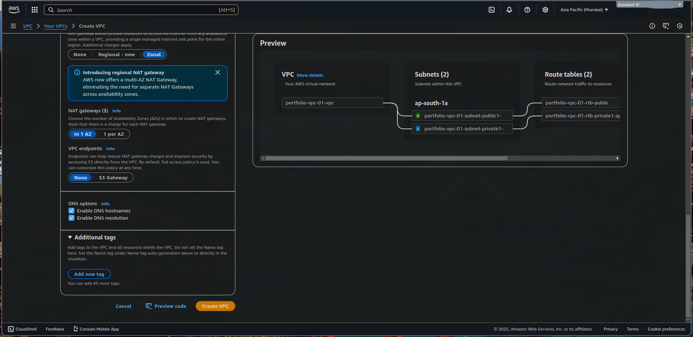
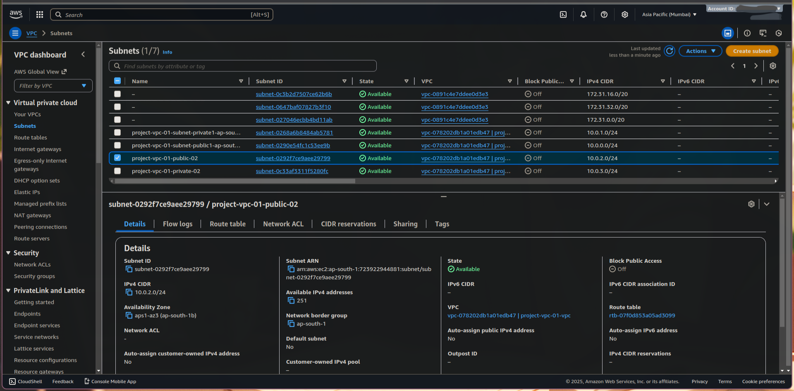

# ☁️ AWS Multi-Availability Zone VPC Architecture


## 📖 Project Overview

This project demonstrates a highly available, fault-tolerant network infrastructure deployed on AWS. The architecture is designed to support a web application with distinct **Public** and **Private** isolation across two Availability Zones (Multi-AZ).

### Key Features

- ✅ **Multi-AZ Redundancy:** Infrastructure spans two Availability Zones for high availability.
- ✅ **Network Isolation:** Public subnets for web servers; Private subnets reserved for database/backend logic.
- ✅ **Secure Outbound Access:** NAT Gateways configured to allow private instances to update without exposing them to the internet.
- ✅ **Automated Configuration:** EC2 instances bootstrapped using Bash User Data scripts.

---

## 🏗️ Architecture Design

### Visual Diagram AI


### Visual Diagram Mine


### Network Breakdown

| Resource                  | CIDR / Detail                | Description                              |
| :------------------------ | :--------------------------- | :--------------------------------------- |
| **VPC**                   | `10.0.0.0/16`                | Main network container                   |
| **Public Subnets**        | `10.0.1.0/24`, `10.0.3.0/24` | Hosts the Web Server (EC2)               |
| **Private Subnets**       | `10.0.2.0/24`, `10.0.4.0/24` | Reserved for future Database/App layers  |
| **Route Table (Public)**  | `0.0.0.0/0` → IGW            | Direct Internet Access                   |
| **Route Table (Private)** | `0.0.0.0/0` → NAT GW         | Indirect Internet Access (Outbound only) |

---

## 🛠️ Tech Stack

- **Cloud Provider:** Amazon Web Services (AWS)
- **Compute:** Amazon EC2 (t2.micro / Free Tier)
- **Networking:** VPC, Subnets, Internet Gateway, NAT Gateway
- **OS:** Amazon Linux 2023
- **Scripting:** Bash (for User Data)

---

## ⚙️ Implementation Guide

### 1. Network Setup

1.  Create a VPC with IPv4 CIDR `10.0.0.0/16`.
2.  Create 2 Public and 2 Private subnets across **ap-south-1-1a** and **ap-south-1-1b**.
3.  Attach an **Internet Gateway (IGW)** to the VPC.
4.  Allocate an Elastic IP and create a **NAT Gateway** in the Public Subnet.

### 2. Routing Configuration

- **Public Route Table:** Associate public subnets and add a route to the IGW.
- **Private Route Table:** Associate private subnets and add a route to the NAT Gateway.

### 3. Security Groups

**Web Server SG (Inbound Rules):**

| Type | Protocol | Port | Source      | Justification            |
| :--- | :------- | :--- | :---------- | :----------------------- |
| HTTP | TCP      | 80   | `0.0.0.0/0` | Allow public web traffic |
| SSH  | TCP      | 22   | `My IP`     | Secure Admin Access      |

### 4. Server Launch

Launch an EC2 instance in the **Public Subnet** and use the following **User Data** script to auto-configure the web server:

```bash
#!/bin/bash
# Install Apache Web Server and PHP
dnf install -y httpd wget php mariadb105-server
# Download Lab files
wget https://aws-tc-largeobjects.s3.us-west-2.amazonaws.com/CUR-TF-100-ACCLFO-2/2-lab2-vpc/s3/lab-app.zip
unzip lab-app.zip -d /var/www/html/
# Turn on web server
chkconfig httpd on
service httpd start
```

---

## 📸 Proof of Work

### 1. Network Configuration

**VPC & Subnets Created**

> _Verification of the VPC creation with distinct Public and Private subnets._
>
> 
> 

**Route Table Associations**

> _Ensuring public subnets are associated with the Internet Gateway route table._
>
> 

### 2. Security & Compute

**Security Group Rules**

> _Inbound rules configured to allow HTTP (Port 80) from anywhere and SSH (Port 22) for administration._
>
> 

**EC2 Instance Summary**

> _The Web Server instance running in the Public Subnet with a valid Public IPv4 address._
>
> 

### 3. Final Validation

**Live Web Page Result**

> _Successful HTTP request to the Public IP (`3.110.167.96`), serving the custom HTML page._
>
> 

## ⚠️ Current Limitations & Trade-offs

- **Single NAT Gateway (Cost vs. Redundancy):**

  - To reduce costs, this architecture uses a **single NAT Gateway** in one Availability Zone.
  - _Risk:_ If the AZ hosting the NAT Gateway fails, private instances in the _other_ AZ will lose outbound internet access.
  - _Production Fix:_ Deploy a distinct NAT Gateway in every AZ.

- **Ephemeral Storage:**

  - The web server stores data on the local EBS root volume. If the instance is terminated, any changes to the website files are lost.
  - _Production Fix:_ Offload static content to S3 or use an EFS (Elastic File System) mount.

- **Security Groups (SSH):**

  - For demonstration purposes, SSH (Port 22) might be open to `0.0.0.0/0` or a wide range.
  - _Risk:_ This exposes the server to brute-force attacks.
  - _Production Fix:_ Restrict SSH access to a specific VPN IP or use AWS Systems Manager (SSM) Session Manager instead of SSH.

- **Manual Deployment ("ClickOps"):**

  - Infrastructure was created manually via the AWS Console, increasing the risk of human error and making replication difficult.

- **No Load Balancer:**

  - The web server is accessed via a direct Public IP. If this instance fails, the site goes down, despite the network being Multi-AZ.

- **HTTP Only:**
  - Traffic is unencrypted (Port 80). Production environments require SSL/TLS (HTTPS) certificates.

## 🚀 Future Roadmap

The following improvements are planned for the next version (v2.0):

**Infrastructure as Code (IaC):**

- Migrate the entire manual setup to Terraform for automated, reproducible deployment.

**Scalability:**

- Introduce an Application Load Balancer (ALB) to distribute traffic.
- Implement Auto Scaling Groups (ASG) to automatically recover from instance failures.

**Database:**

- Deploy an RDS instance in the private subnets to create a full 2-Tier architecture.
